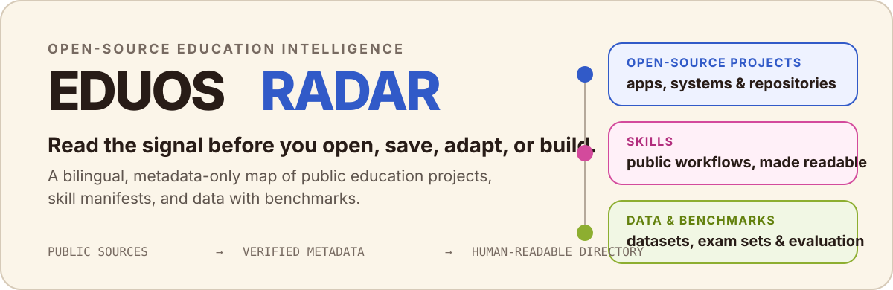
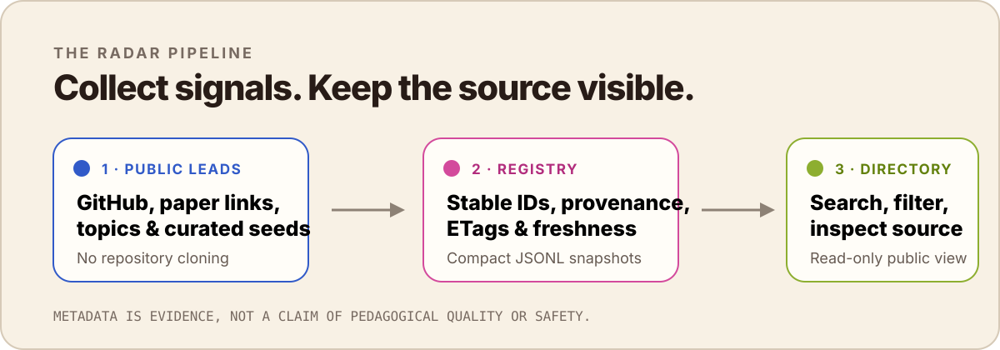

<p align="center">
  
</p>

<p align="center">
  <a href="https://eduos-github-radar.vercel.app">Open the Radar</a>
  · <a href="#what-you-can-browse">Browse the collections</a>
  · <a href="#run-a-refresh">Run a refresh</a>
  · <a href="#trust-boundary">Read the boundary</a>
</p>

# EduOS Radar

**A bilingual, human-readable directory of public education technology.** It
helps educators, builders and researchers decide what is worth opening, saving,
adapting or studying before they invest time in a repository.

The public site is a read-only view of a compact metadata registry. It is not a
code host, a package installer, a model evaluation, or a recommendation that a
project is safe or pedagogically effective.

## What you can browse

Radar is moving toward three peer collections. **GitHub is a source, not the
top-level product category.**

| Collection | What it is for | Current source boundary |
| --- | --- | --- |
| **Apps & systems** | Open-source education projects, tools and complete systems to inspect or adapt. | Public GitHub repository metadata. Existing `repo` records are a high-recall discovery set, not a claim that every record is a polished application. |
| **Skills** | Public `SKILL.md` manifests for inspecting a workflow before installing or adapting it. | Public repository metadata, Git tree paths and manifest frontmatter only. |
| **Data & benchmarks** | Datasets, question/exam sets, learning traces and evaluation benchmarks. | A dedicated metadata view today; it can later include non-GitHub sources without changing the public taxonomy. |

<p align="center">
  
</p>

### What the website shows

- search, subject, language, activity and project-shape filters;
- English / Chinese interface switching;
- repository description, source link, homepage, license, stars, last push and
  declared metadata;
- a separate Skills shelf with source-repository and public-manifest links;
- an optional project-suggestion form. Private learning goals never enter the
  public catalog.

Open the live directory at **[eduos-github-radar.vercel.app](https://eduos-github-radar.vercel.app)**.

## Trust boundary

| Radar does | Radar deliberately does not do |
| --- | --- |
| Collect public repository metadata, stable GitHub IDs, provenance, timestamps, declared topics, languages, licenses and release state. | Clone repositories, store source trees, execute Skills, install packages, or perform deep code analysis. |
| Deduplicate GitHub repositories by numeric repository ID; keep `first_seen`, `last_seen`, `fetched_at` and source provenance. | Treat GitHub verification as an endorsement, a quality score, a security review or evidence of pedagogical alignment. |
| Publish a field-allowlisted snapshot and keep the larger discovery registry local. | Write to EduOS substrate nodes, `SCHEMA.md`, `VOCABULARY.md`, papers, products, reviews or merged graphs. |

`dataset`, `benchmark`, `awesome_index` and `repo` are lightweight discovery
shapes inferred from public metadata or an explicit lead. They are not a deep
capability classification.

## Repository map

```text
config/       exact leads and bounded English/Chinese discovery matrices
scripts/      dependency-free metadata collectors, validators and snapshot builders
data/         canonical JSONL registries and compact run snapshots
schema/       independent Radar registry contracts
site/         dependency-free static reader and generated public snapshot
web/          Next.js / React public directory (the Vercel deployment root)
docs/         GitHub API, deployment and Skills-roadmap decisions
migrations/   optional future Postgres schemas
```

The collector and website are intentionally separate: collection writes the
registry; presentation reads only the generated public snapshot.

## Run a refresh

Python 3.10+ is sufficient for collection and validation; the Python tools have
no third-party dependencies. Use a read-only GitHub token for larger runs, but
never commit it.

```bash
cd github-radar

# Validate code and configuration without network access.
python3 -m py_compile scripts/crawl.py scripts/build_site.py scripts/validate.py
python3 -m json.tool config/seeds.json >/dev/null
python3 -m json.tool config/query-matrix.json >/dev/null
python3 scripts/validate.py --report reports/data-quality-$(date -u +%F).md

# Resolve a small exact/named lead batch. No clone occurs.
python3 scripts/crawl.py seed --limit 5

# Run a bounded discovery family, then hydrate only a small priority queue.
GH_TOKEN="$(gh auth token)" python3 scripts/crawl.py discover \
  --family dataset-benchmark \
  --pages 1 \
  --per-page 50 \
  --sort updated \
  --hydrate-limit 10

# Build the allowlisted public data snapshot.
python3 scripts/build_site.py
```

For controlled incremental work, use:

```bash
# Conditional refresh through saved ETags.
python3 scripts/crawl.py refresh --limit 50

# Fill languages and latest-release metadata later, prioritising leads.
python3 scripts/crawl.py hydrate --lead-only --limit 20

# Verify exact owner/repo names extracted from an approved awesome index.
python3 scripts/crawl.py expand --lead-file config/awesome-leads.txt
```

See [GitHub API notes](./docs/github-api.md) for pagination, search ceilings,
ETags, rate limits and backoff. Broad crawling must stay out of public page
requests.

## Build the public site

The production site is an open-source **Next.js** application deployed from
`web/`. Using Vercel does not make the project less open source: GitHub is the
collaboration and source-of-truth home; Vercel supplies the public runtime,
serverless suggestion endpoint and a future path for scheduled refreshes.

```bash
cd github-radar/web
npm install
npm run sync:data
npm run dev
npm run build
```

For Vercel, set the project **Root Directory** to `web`. The first launch reads
the generated snapshot and needs no browser-visible GitHub token or database.
The optional `POST /api/suggestions` route needs `DATABASE_URL` only when a
managed Postgres database is intentionally enabled.

## Scale without changing the public contract

1. **100–2,000 records** — JSONL canonical registry, bounded API runs and a
   generated static snapshot.
2. **2,000+ records** — managed Postgres, append-only discovery rows, scheduled
   collection outside public requests, and a cached read-only query API.
3. **Semantic / intent-first discovery** — add human-reviewed descriptors first;
   use embeddings for recall only, while source URLs and metadata remain
   authoritative.

The current managed-database, backup, cache, search and safety route is in
[docs/deployment.md](./docs/deployment.md). The Skills collection's scope and
future EduOS handoff are in [docs/skills-roadmap.md](./docs/skills-roadmap.md).

## Before contributing a lead

Please provide an exact public repository URL whenever possible. A named lead
is first recorded as `unverified`; an API match can still remain `probable` when
the name is ambiguous. Keep any claim about learning impact, safety or quality
out of the lead itself unless a curator later records evidence for it.

## License and attribution

This repository keeps collection artifacts, generated snapshots and website
code together so that the public directory can be inspected, reproduced and
improved in the open. Refer to each listed project's own license and source
before reuse; Radar records observed license metadata but does not grant rights
on a project's behalf.
